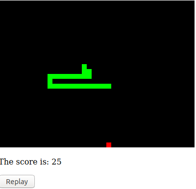

# C-WebSnake
## Description
A trivial snake done in C++ using Cheerp to compile into javascript to run it on your browser.

It is ugly (both the output and the C++ code) but for my defense I made this project to test Cheerp during an afternoon and I never made anything in html. (Except 10 years ago when I was in middle school so it does not really count)

## How to compile
Run `/opt/cheerp/bin/clang++ -std=c++1z -target cheerp -O2 main.cpp -o main.js`
On Windows the path of the compiler is different but arguments are the same.

You must have Cheep installed to compile it: https://github.com/leaningtech/cheerp-meta

But if you can't or don't want to there is already the output file (main.js) in the repo.

## How to run
Open the file main.html with your favorite browser (Firefox of course) like that.
`firefox main.html`

But it is also hosted on my raspberry pi and available online here: https://www.baduit.eu/snake/main.html. (If the link does not work it probably means I am experimenting stuff on my pi)

## Todo
* Add a way to configure the speed